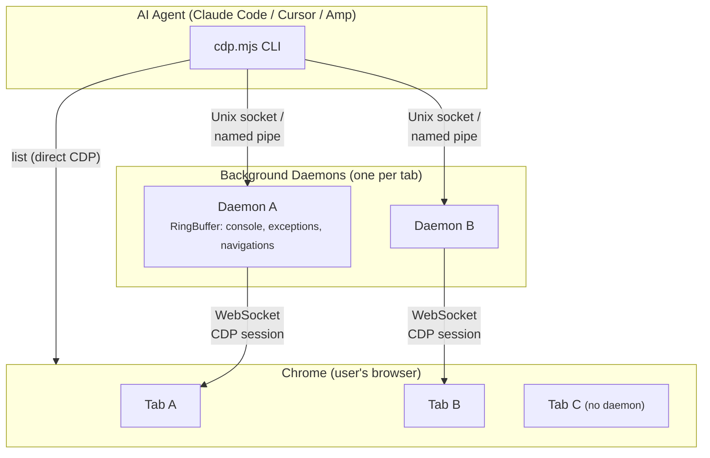

# chrome-cdp (enhanced fork)

> Forked from [pasky/chrome-cdp-skill](https://github.com/pasky/chrome-cdp-skill) — extended with background observation, form automation, realistic input simulation, and WSL2 support.

Let your AI agent see and interact with your **live Chrome session** — the tabs you already have open, your logged-in accounts, your current page state. No browser automation framework, no separate browser instance, no re-login.

## Installation

Copy the `skills/chrome-cdp/` directory wherever your agent loads skills from.

**Requirements:** Node.js 22+ (uses built-in WebSocket). No npm install needed.

**Setup:** Navigate to `chrome://inspect/#remote-debugging` and toggle the switch. That's it — do **not** restart Chrome with `--remote-debugging-port`.

Auto-detects Chrome, Chromium, Brave, Edge, and Vivaldi on macOS, Linux (including Flatpak), and Windows. Set `CDP_PORT_FILE` to override the DevToolsActivePort path, or `CDP_HOST` to override the Chrome host (default: `127.0.0.1`).

## What this fork adds

The upstream is an excellent **observe-and-click** tool (12 commands). This fork extends it to **27 commands** with:

- **Perceive-first observation** — `perceive` produces an enriched accessibility tree with inline layout annotations (height, background color, font size, display mode, viewport visibility). One command gives the agent complete page understanding without any screenshots.
- **Element-level screenshots** — `elshot` captures a specific element by CSS selector, auto-scrolling into view and clipping to its bounds. No DPR confusion, no wrong-scroll-position errors.
- **Background console observation** — daemon passively buffers console output, exceptions, and navigations via `RingBuffer`; query anytime with `status` / `console` / `summary`
- **Realistic click simulation** — uses CDP `Input.dispatchMouseEvent` (mouseMoved → mousePressed → mouseReleased) instead of `el.click()`, working with React, Vue, Angular, and Shadow DOM
- **Form automation** — `fill`, `select`, `press`, `waitfor` for complete form workflows
- **Page inspection** — `scanshot` (segmented full-page), `styles` (computed CSS), `cookies`, `hover`, `scroll`
- **WSL2 support** — proven patterns for controlling Windows Chrome from WSL2 (see [SKILL.md](skills/chrome-cdp/SKILL.md))

## Architecture



Each tab gets its own daemon process that holds the CDP session open — Chrome's "Allow debugging" dialog fires **once per tab**, not once per command. Daemons auto-exit after 20 minutes of inactivity and passively collect console/exception/navigation events into ring buffers.

## Commands

```bash
# Discovery & lifecycle
list                               # list open tabs
open   [url]                       # open new tab
stop   [target]                    # stop daemon(s)

# Perception (start here)
perceive <target>                  # enriched AX tree with layout annotations (recommended)
snap     <target> [--full]         # accessibility tree (compact by default)
summary  <target>                  # token-efficient overview (~100 tokens)
status   <target>                  # URL, title + new console/exception entries
console  <target> [--all|--errors] # console buffer (default: unread only)

# Visual verification (only when needed)
elshot   <target> <selector>       # element screenshot (auto scroll + clip, no DPR issues)
shot     <target> [file]           # viewport screenshot
scanshot <target>                  # segmented full-page (readable viewport-sized images)
fullshot <target> [file]           # single full-page image (tiny on long pages)

# Inspection
html    <target> [selector]        # full HTML or scoped to CSS selector
eval    <target> <expr>            # evaluate JS in page context
styles  <target> <selector>        # computed styles (meaningful props only)
net     <target>                   # network resource timing
cookies <target>                   # list cookies for current page

# Interaction
click   <target> <selector>        # click element (CDP mouse events)
clickxy <target> <x> <y>           # click at CSS pixel coordinates
type    <target> <text>            # type at focused element (cross-origin safe)
press   <target> <key>             # press key (Enter, Tab, Escape, etc.)
scroll  <target> <dir|x,y> [px]   # scroll (down/up/left/right; default 500px)
hover   <target> <selector>        # hover (triggers :hover, tooltips)
fill    <target> <selector> <text> # clear field + type (form filling)
select  <target> <selector> <val>  # select dropdown option by value
waitfor <target> <selector> [ms]   # wait for element to appear (default 10s)
loadall <target> <selector> [ms]   # click "load more" until gone
evalraw <target> <method> [json]   # raw CDP command passthrough
```

`<target>` is a unique prefix of the targetId shown by `list`. See [SKILL.md](skills/chrome-cdp/SKILL.md) for detailed usage, workflow patterns, coordinate system, and WSL2 instructions.

## Credits

- **Original**: [pasky/chrome-cdp-skill](https://github.com/pasky/chrome-cdp-skill) by Petr Baudis — daemon-per-tab architecture and core CDP client
- **This fork**: Background observation, realistic input simulation, form automation, WSL2 support, and additional inspection commands

## License

MIT
