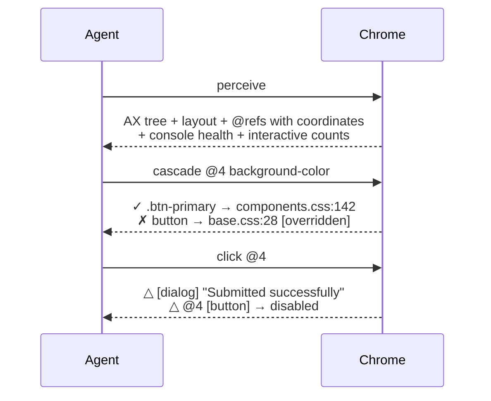
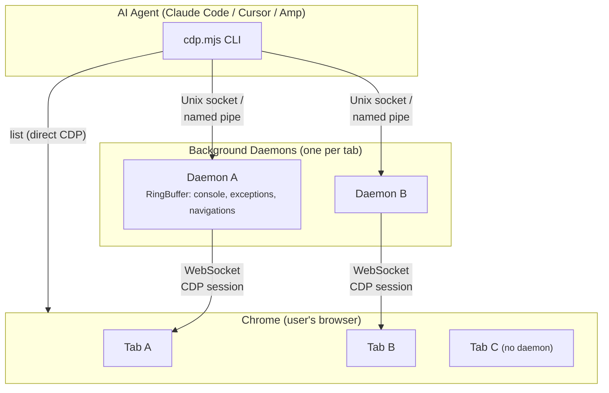
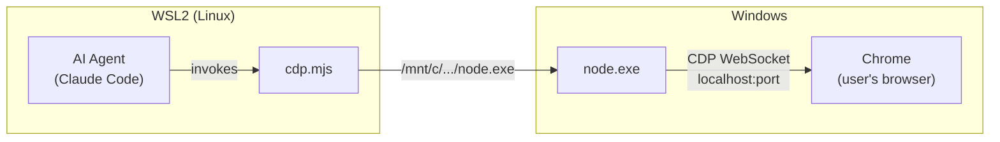

# chrome-cdp-ex

[](skills/chrome-cdp-ex/scripts/cdp.mjs)
[](skills/chrome-cdp-ex/scripts/cdp.mjs)
[](https://nodejs.org)
[](LICENSE)

> Most browser automation tools launch a clean, isolated browser.
> `chrome-cdp-ex` connects to your real browser session: tabs, logins, cookies, and current page state.

## Why this exists

- **Perceive-first workflow:** one call gives structure, layout, styles, coordinates, and console health.
- **CSS origin tracing:** `cascade` tells the agent exactly which file and line to edit — not just what the style is, but where it comes from.
- **Low round-trip cost:** understand in 1 call, act in 1 call, verify automatically.
- **Live prototyping:** `inject` CSS/JS into the page, test changes visually, remove when done — no dev server restart.
- **Real-session automation:** no separate Chromium profile unless you want one.
- **Production-ready ergonomics:** daemon-per-tab, background event collection, WSL2-to-Windows support, Electron support.

## Contents

- [The Redesign Experiment](#the-redesign-experiment)
- [Quick Start](#quick-start)
- [How It Works](#how-it-works)
- [Commands (53 total)](#commands-53-total)
- [WSL2 -> Windows Browser Control](#wsl2---windows-browser-control)
- [Credits](#credits)
- [License](#license)

## The redesign experiment

Same ugly page. Same prompt. 5 rounds. Three independent AI agents, each with a different browser observation tool.
**Only one variable changed: how much visual state each tool exposes.**

| Before | `chrome-cdp-ex` | Playwright | Other CDP |
|---|---|---|---|
|  |  |  |  |

The agent using `perceive` (layout + colors + spacing + coordinates) produced the most polished result because it could actually **see** what needed fixing, not just parse source code.
[**View the live comparison ->**](https://endeavoryen.github.io/chrome-cdp-ex/experiment/showcase.html)

### The numbers

| | `chrome-cdp-ex` | Playwright | Other CDP tools |
|---|---|---|---|
| **Calls to fully understand a page** | **1** (`perceive`) | 3+ (snapshot + console + viewport) | 2+ (snap + console) |
| **Tokens per page snapshot** | **~800** (with layout + styles) | ~3,500 (no layout, no styles) | ~400 (no layout, no styles) |
| **Calls to act and verify** | **1** (auto feedback) | 2+ (act + re-snapshot) | 2+ (act + re-snapshot) |
| **`@ref` with coordinates** | **Yes** - `@3 (200,350 200x30)` | No - `ref=e376` (ID only) | No |
| **Your real browser session** | **Yes** - tabs, cookies, logins | No - isolated Chromium | Varies |
| **CSS origin tracing** | **Yes** - `cascade` shows file:line | No | No |
| **Live CSS/JS injection** | **Yes** - `inject` with tracking + removal | No (page.evaluate only) | No |
| **Background event collection** | **Yes** - console, errors, navigations | Only while connected | No |
| **Electron app support** | **Yes** - `CDP_PORT=9222` | No | No |
| **WSL2 -> Windows** | **Yes** - built-in | No | No |
| **Dependencies** | **0** | Playwright + Chromium binary | Varies |
| **Commands** | **50** | N/A (programmatic API) | ~14 |

## One command, complete page understanding

Other tools either give a screenshot and say "figure it out" or dump an AX tree without context.
`perceive` gives agents everything needed in one call:

```text
$ cdp perceive abc1
📍 My App (1280x720 scroll:0/2400) — https://app.example.com
  [banner] ↕80px bg:rgb(26,26,46) ↑above fold
    [nav] flex
      @1 [link] "Home" (12,8 60x20)
      @2 [link] "Settings" (80,8 70x20)
  [main] ↕2920px
    @3 [textbox] "Email" (200,350 200x30)
    @4 [button] "Submit" (200,400 100x40)
  [contentinfo] ↕160px ↓below fold
Console: 2 errors | Interactive: 12 a, 3 button, 2 input
```

Structure. Layout. Styles. Scroll position. Console health. Interactive counts.
Each `@ref` includes bounding coordinates, all in about **~800 tokens**.

## "Which file do I edit to change this blue?"

Other tools can tell an agent *what* the page looks like. Only `cascade` tells it *why*:

```text
$ cdp cascade abc1 @4 background-color

background-color: #2563eb
  ✓ .btn-primary { background-color: #2563eb }
    → src/styles/components.css:142
  ✗ button { background-color: #e5e7eb }  [overridden]
    → src/styles/base.css:28
```

One command. Source file. Line number. Full cascade. The agent can now go directly to `components.css:142` and make the change — no guessing, no grepping through stylesheets.

Pair it with `inject` for live prototyping:

```text
$ cdp inject abc1 --css ".btn-primary { background: #dc2626 }"
inject-1

$ cdp inject abc1 --remove inject-1    # undo when done
```

## Why agents choose this



**One call to understand. One call to trace CSS origin. One call to act. Zero extra calls to verify.**
Action feedback is automatic.

## Quick start

1. Clone and enter the repo.

```bash
git clone https://github.com/EndeavorYen/chrome-cdp-ex.git
cd chrome-cdp-ex
```

2. Install in Claude Code (choose one option).

```bash
# Option A: load in Claude Code for the current project/session
claude --plugin-dir .

# Option B: install globally for all projects
mkdir -p ~/.claude/skills
cp -r skills/chrome-cdp-ex ~/.claude/skills/
```

3. Connect — pick whichever path fits your machine:

- **Existing browser session (preferred):** open `chrome://inspect/#remote-debugging` (or `edge://inspect`) and toggle remote debugging on. Cleanest path; touches no profile state.
- **Isolated debug profile (when the toggle path doesn't work):** `node skills/chrome-cdp-ex/scripts/cdp.mjs spawn-debug-browser edge --port 9222 --url https://example.com`. Spawns the browser with `--remote-debugging-port` and a disposable `--user-data-dir`, leaving your main profile alone. Use `--exe /path/to/browser` for non-standard installs; Linux also falls back to common browser names on `$PATH`. Run `cdp doctor` first to confirm no port conflict.
- **Electron app:** start it with `--remote-debugging-port=<port>` and run with `CDP_PORT=<port>`.

**Requires:** Node.js 22+ (uses built-in WebSocket). Auto-detects Chrome, Chromium, Brave, Edge, and Vivaldi on macOS, Linux (including Flatpak), and Windows.

<details>
<summary><strong>Electron App Support</strong></summary>

Connect to Electron apps exactly like Chrome, as long as remote debugging is enabled.

**Step 1: Enable CDP in your Electron app** (dev mode only)

```js
// In your main process (e.g. src/main/index.ts)
if (process.env.NODE_ENV === 'development') {
  app.commandLine.appendSwitch('remote-debugging-port', '9222');
}
```

Or launch with a flag:

```bash
# macOS/Linux
electron . --remote-debugging-port=9222

# Windows (PowerShell)
electron . --remote-debugging-port=9222
```

**Step 2: Connect**

```bash
CDP_PORT=9222 cdp.mjs list
```

Output:

```text
[Electron 33.4.11]
1ED3DBAA  My App                                                  http://localhost:5173/#/menu
```

All 50 commands work: `perceive`, `click`, `fill`, `cascade`, `record`, `inject`, `flow`, `repeat`, `doctor`, and more.

</details>

<details>
<summary><strong>Advanced Configuration</strong></summary>

- `CDP_PORT` - connect to a specific port (Electron, Chrome with `--remote-debugging-port`, etc.)
- `CDP_PORT_FILE` - override the `DevToolsActivePort` file path
- `CDP_HOST` - override the target host (default: `127.0.0.1`)

</details>

## How It Works



Each tab gets its own daemon process that keeps the CDP session open.
Chrome's "Allow debugging" dialog appears **once per tab**, not once per command.
Daemons auto-exit after 20 minutes of inactivity and passively collect console/exception/navigation events into ring buffers.

## Commands (53 total)

Tip: start with `perceive`, then use `click`/`fill`/`select`; use `status` or `console` when you need debugging context.

### MUD / game / long-session recipes

`chrome-cdp-ex` was hardened against real long-session play feedback (15–20 minute MUD playtests, combat logs, modals that share keys with global hotkeys). Patterns the tool now supports first-class:

```bash
# Advance through dialogue / cutscenes safely (fail-fast on first error):
cdp repeat <t> 5 press space

# Fire a hotkey N times, keep going past transient misses:
cdp repeat <t> 8 --continue press c

# Pass CJK / shell-hostile expressions without quoting headaches:
B64=$(printf '%s' 'document.title.includes("戰鬥勝利")' | base64)
cdp eval64 <t> "$B64"
cdp eval   <t> --b64 "$B64"

# Click via HTMLElement.click() when an overlay blocks the realistic mouse path
# (common for modals that paint over their own buttons):
cdp jsclick <t> @17
cdp click   <t> --js "button[data-action='confirm']"

# Wait for a combat log line, then snapshot the result:
cdp waitfor <t> --any-of "戰鬥勝利|戰敗|逃跑成功" 60000 --scope ".combat-log"
cdp waitfor <t> --selector-stable ".combat-log" 3000 60000
cdp text    <t> ".combat-log"

# Capture cause-and-effect of a single action (DOM + network + console):
cdp record <t> --action click @5 --until "dom stable"

# Dismiss MOTD / modal without firing the underlying game's hotkey:
cdp dismiss-modal <t>     # close button → Escape fallback (NEVER Space)
```

**Sequence capture pattern** — fold these into a single readable transcript with `flow`:

```bash
cdp flow <t> "perceive -i; click @5; wait dom stable; perceive --diff; text .combat-log"
```

For a multi-turn loop where you want fail-fast safety per turn, layer `repeat` over `flow` — the inner `flow` body becomes one "turn", and `repeat` halts on the first turn that fails:

```bash
# 3 combat turns; each turn clicks attack, waits for the DOM to settle, then
# checks the log. Quoting matters: the whole flow body is a single arg.
cdp repeat <t> 3 flow "click button[data-act='attack']; wait dom stable; text .combat-log"

# Single-command body is fine too — fail-fast on first stale @ref:
cdp repeat <t> 3 click @attackBtn
# When the DOM rewrites @5 between turns, switch to a stable selector instead:
cdp repeat <t> 3 click "button[data-act='attack']"
```

`repeat` allows wrapping `flow` (one-level nesting) but still refuses to wrap `repeat`, `batch`, or `stop` — those would either recurse or corrupt the daemon IPC stream.

**Stale `@ref` reminder** — refs are short-lived handles assigned by `perceive`. They do **not** auto-remap after navigation, Vite HMR, or large DOM mutations. The error you'll see is now classified (e.g. `Unknown ref: @31. Refs were cleared because the page navigated/reloaded …`). Honour it: re-run `perceive`, or — for any loop longer than 1–2 immediate actions — use a stable CSS selector. `repeat` does not retry around stale refs because remapping a ref to "the new equivalent" cannot be done correctly without agent context.

<details>
<summary><strong>Discovery & Lifecycle</strong></summary>

```bash
list                               # list open tabs (shows targetId prefixes; about:blank is included as "(blank tab)")
open   [url]                       # open new tab (default: about:blank)
spawn-debug-browser [edge|chrome|brave] [--port 9222] [--url URL] [--profile-dir DIR] [--exe PATH]
                                   # launch an isolated debug profile (disposable user-data-dir + remote-debugging-port)
                                   # `spawn` is a short alias
stop   [target]                    # stop daemon(s)
closetab <target>                  # close a browser tab
keepalive <target> <ms>            # extend a tab daemon lifetime for long background work
doctor / ready                     # one-call diagnostics (no target needed)
                                   # checks: Node 22+, skill install, daemon sockets, CDP reachability
                                   # prints OK/WARN/FAIL with hints; exits 1 if any check FAILs
```

</details>

<details open>
<summary><strong>Perception</strong> - start here</summary>

```bash
perceive <target> [flags]          # enriched AX tree with @ref indices + viewport CSS coordinates
                                   #   --diff: show only changes since last perceive
                                   #   -s <sel>: scope to CSS selector subtree
                                   #   -i: interactive elements only
                                   #   -d N: limit tree depth
                                   #   -C: include non-ARIA clickable elements
                                   #   --keep-refs: preserve every @ref line under truncation
                                   #   --last N: keep only the last N text/log rows
                                   # Coords are viewport CSS pixels — same frame as clickxy.
                                   # Fixed/sticky elements get a ", fixed"/", sticky" tag.
snap     <target> [--full]         # accessibility tree (compact by default)
summary  <target>                  # token-efficient overview (~100 tokens)
status   <target> [--runtime]      # URL, title + new console/exception entries; --runtime adds Performance metrics
console  <target> [--all|--errors] # console buffer (default: unread only; preserves log/warn/error/debug levels)
text     <target>                            # clean text content (strips scripts/styles/SVG)
text     <target> "main, [role=main], #app .main"   # fallback chain — first match wins
text     <target> --auto                     # heuristic main-content extraction (no nav/aside/footer)
text     <target> --auto --exclude ".sidebar,.banner"
text     <target> --root auto "header"       # scope to #root/[data-reactroot]/main/body; header falls back to banner/h1/h2
table    <target> [selector]       # full table data extraction (tab-separated)
```

</details>

<details>
<summary><strong>Visual Capture</strong></summary>

```bash
shot     <target> [file] [--quiet|--verbose|--annotate]
                                   # viewport screenshot. By default the saved path is on the
                                   # FIRST line of stdout (good for `head -1`), followed by a short DPR hint.
                                   # --quiet  print ONLY the saved path
                                   # --verbose include the full coordinate-mapping tutorial
                                   # --annotate overlay @ref labels onto the screenshot
elshot   <target> <sel|@ref>        # element screenshot (auto scroll + clip, no DPR issues)
scanshot <target>                   # segmented full-page (readable viewport-sized images)
fullshot <target> [file]            # single full-page image (may be tiny on long pages)
```

</details>

<details>
<summary><strong>Inspection</strong></summary>

```bash
html      <target> [selector]       # full HTML or scoped to CSS selector
eval      <target> <expr>           # evaluate JS in page context
eval      <target> --b64 <base64>   # decode UTF-8 base64 first
eval      <target> --fire-and-forget <expr>  # dispatch async/background JS without awaiting its promise
call      <target> <expr|fn>        # await expression/function result and print JSON when possible
styles    <target> <selector>       # computed styles (meaningful props only)
net       <target>                  # network performance entries
netlog    <target> [--clear]        # network request log (XHR/Fetch with status + timing)
cookies   <target>                  # list cookies for current page
cookieset <target> <cookie>         # set a cookie ("name=value; domain=...")
cookiedel <target> <name>           # delete a cookie by name
```

</details>

<details>
<summary><strong>Interaction</strong></summary>

```bash
click   <target> <sel|@ref>         # click element (CDP mouse events, not el.click())
click   <target> --js <sel|@ref>    # JS-fallback: HTMLElement.click() — bypasses overlays/hit-testing
jsclick <target> <sel|@ref>         # alias for click --js
clickxy <target> <x> <y>            # click at CSS pixel coordinates
type    <target> <text>             # type at focused element (cross-origin safe)
press   <target> <key>              # press key (Enter, Tab, Escape, Backspace, Space, Arrow*,
                                    # AND single characters a-z / A-Z / 0-9 / common punctuation)
scroll  <target> <dir|x,y> [px]     # scroll (down/up/left/right; default 500px)
hover   <target> <sel|@ref>         # hover (triggers :hover, tooltips)
fill    <target> <sel|@ref> <text>  # clear field + type (form filling)
fill    <target> --react <sel|@ref> <text>  # native value setter + input/change events for React controlled inputs
wait    <target> <ms>               # delay inside cdp; also supports: cdp wait <ms> [target]
select  <target> <selector> <val>   # select dropdown option by value
waitfor <target> <selector> [ms]              # wait for element to appear (default 10s)
waitfor <target> --gone <sel|@ref> [ms]       # wait for element to DISAPPEAR
waitfor <target> --text "str" [--scope sel] [ms]  # wait for text to appear
waitfor <target> --any-of "a|b|c" [ms] [--scope sel]  # any of the alternatives appears
waitfor <target> --selector-stable <sel> [stableMs] [timeoutMs]  # wait until selector stops mutating
dismiss-modal <target>              # close visible modal/dialog safely (close button, fallback Escape)
loadall <target> <selector> [ms]    # click "load more" until gone
upload  <target> <selector> <paths> # upload file(s) to <input type="file">
dialog  <target> [accept|dismiss]   # dialog history; set auto-accept or auto-dismiss
```

</details>

<details>
<summary><strong>Navigation & Viewport</strong></summary>

```bash
nav      <target> <url>             # navigate to URL and wait for load
back     <target>                   # navigate back in browser history
forward  <target>                   # navigate forward
reload   <target>                   # reload current page and clear console/exception/navigation buffers
viewport <target> [WxH]             # show or set viewport size (e.g. 375x812)
```

</details>

<details>
<summary><strong>Frontend Development</strong> (v2.2.0)</summary>

```bash
inject  <target> --css "<text>"     # inject inline <style> with tracking
inject  <target> --css-file <url>   # inject <link rel="stylesheet">
inject  <target> --js-file <url>    # inject <script src> and wait for load
inject  <target> --remove [id]      # remove injected element(s) — all or by id
cascade <target> <sel|@ref>         # CSS origin tracing: full cascade with source file + line
cascade <target> <sel|@ref> <prop>  # filter to one property (e.g. "background-color")
record  <target> [ms]               # timeline of DOM/console/network/navigation events
record  <target> --action click @5  # record cause → effect around an action;
                                    # auto-settles when no duration/--until given
                                    # (cap: 5s without network activity, 10s with)
record  <target> --until "dom stable"|"network idle"  # record until quiet (max 30s)
```

`inject` returns an ID (`inject-1`, `inject-2`...) for targeted removal. URLs are validated (blocks `data:`, `file:`, cloud metadata).

`cascade` shows which CSS rule won, which were overridden, inline styles, and inherited properties — with source locations. Answers "which file do I edit?" in one call. For Vite / CSS Modules pipelines, `cascade` also reads inline base64 source maps and stripped `?vue&type=style&…` query suffixes, so locations resolve to the original `*.module.css` / `*.vue` source instead of an opaque stylesheet id.

</details>

<details>
<summary><strong>Advanced</strong></summary>

```bash
batch   <target> <cmds> [flags]     # execute multiple commands in one call (default JSON output)
                                    # pipe:    'fill @3 hi | click @7'
                                    # JSON:    '[{"cmd":"click","args":["@1"]},{"cmd":"perceive","args":["--diff"]}]'
                                    # --parallel  run independent commands concurrently
                                    # --plain     human-readable, indented per step
                                    # --compact   one line per step
flow    <target> "<steps>"          # sequential pipeline; semicolon-separated steps; halts on first error
                                    # e.g. flow <t> "click @1; wait dom stable; summary; console --errors"
                                    # wait aliases: "wait dom stable", "wait network idle"
repeat  <target> <N> <cmd> [args]   # run a single command up to N times (cap 50). Fail-fast by default.
                                    # --continue / -c  keep going through errors and report tally
                                    # e.g. `repeat <t> 5 press space` to advance MUD dialogue
                                    # NOTE: refs are NOT auto-remapped between iterations — use stable
                                    # selectors if the DOM mutates during the loop.
eval    <target> <expr>             # evaluate JS in page context
eval    <target> --b64 <base64>     # decode UTF-8 base64 first (CJK / shell-hostile transport)
eval    <target> --fire-and-forget <expr>  # start async/background JS; returns after dispatch; keeps daemon alive 1h
eval64  <target> <base64>           # alias for `eval --b64`
call    <target> <expr|fn>          # await page function/expression result, including promises, as JSON when possible
evalraw <target> <method> [json]    # raw CDP command passthrough
                                    # e.g. evalraw <t> "DOM.getDocument" '{}'
```

</details>

**Action feedback:** `click`, `clickxy`, `press` (Enter/Escape/Tab), `select`, `scroll`, and viewport resizing automatically wait for DOM to settle and return a `perceive` diff showing what changed. If the action was sent but the post-action observation times out during a React rerender or navigation churn, the command reports `success but observation timed out` instead of a pure timeout, so agents should verify with `perceive --diff` or `status` rather than retrying the click.

Use `wait` instead of shell `sleep` when policy blocks long sleeps:

```bash
cdp wait <target> 30000
cdp wait 30000 <target>
cdp wait 30000
```

Use `call` for page-level functions whose results matter, and `eval --fire-and-forget` for intentional background loops:

```bash
cdp call <target> "async () => window.app.getState()"
cdp eval <target> --fire-and-forget "setInterval(() => window.tick?.(), 1000)"
cdp keepalive <target> 3600000
```

`<target>` is a unique targetId prefix from `list`. See [SKILL.md](skills/chrome-cdp-ex/SKILL.md) for detailed usage patterns and coordinate-system notes.

## WSL2 -> Windows Browser Control

This tool works across the WSL2-to-Windows boundary, where many CDP tools fail.



The key insight: WSL2 cannot connect to Windows `localhost` directly, so the script runs **Windows-side `node.exe`** via `/mnt/c/...` and lets that process connect to Chrome natively.

Proven pattern:

1. Start Chrome **on Windows** and enable debugging at `chrome://inspect/#remote-debugging`.
2. Use **Windows-side Node.js** to run the CDP script.
3. Locate Node.js:
   ```bash
   powershell.exe -NoProfile -Command "(Get-Command node -ErrorAction SilentlyContinue).Source"
   ```
4. Convert to a WSL mount path and invoke:
   ```bash
   "/mnt/c/.../node.exe" scripts/cdp.mjs list
   ```

See [SKILL.md](skills/chrome-cdp-ex/SKILL.md) for full WSL2 setup instructions.

## Credits

- **Original**: [pasky/chrome-cdp-skill](https://github.com/pasky/chrome-cdp-skill) by Petr Baudis (daemon-per-tab architecture and core CDP client)
- **Contributors**: [ynezz](https://github.com/ynezz) (Flatpak paths), [Jah-yee](https://github.com/Jah-yee), [Rolf Fredheim](https://github.com/rolfredheim)
- **This fork**: `@ref` system, perceive-first workflow, action feedback, background observation, realistic input simulation, form automation, WSL2 support, and 28 additional commands

## License

[MIT](LICENSE)
